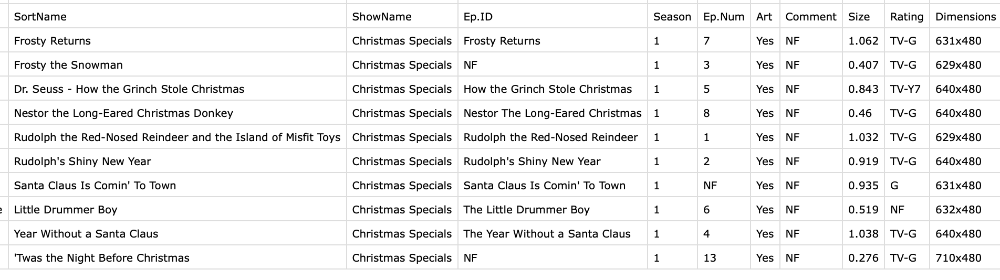

# Atomizer 

This is an Applescript script that parses metadata atoms from .m4v and .mp4 encoded video files.
Obviously, it only runs under OSX.

It is offered as proof-of-concept. Delightfully useless yet deliciously alluring. This basic algorithm could be extended or re-tooled for a variety of needs.

This script has nothing to do with the hackable text editor named Atom.

## What It Does:

1. The script allows the user to choose one or more paths (folders).
2. The script examines those folders for all .mp4 and .m4v video files
3. Each video file in those folders is scanned for its atomic meta data
4. The meta data is harvested and saved into a .csv file, one row per video file.

An example of .csv output (only a few columns shown):

## The Atomic Meta Data Harvested:
Atoms are returned if found. If not found, then "NF" is returned.

#### The Video Type atom (stik)
This atom is integer coded in the video file. A string is returned by the script based on the numeric value found:
- 0 or 9: returns "Movie"
- 10: returns "TV Show"
- 6: returns "Music Video"

For any other (non-video) values the integer is returned as-is.

#### The Name Atom (©nam)
The name of the movie or show. This atom is string coded in the video file. The string is returned but any quotes contained are re-coded (changed from " to "") for CSV

#### The Tool Atom (©too)
The tool that created the file (if present). e.g., *Handbrake 0.9.5*. This atom is string coded in the video file. The string is returned but any quotes contained are re-coded (changed from " to "") for CSV

#### The Description Atom (desc)
The short (summary) description of the video. This atom is string coded in the video file. The string is returned but any quotes contained are re-coded (changed from " to "") for CSV. Any carriage returns in the string are replaced with "CR" for CSV compliance. Note that with an easy change to the script these could simply be removed as well.

#### The (pre-defined) Genre atom (gnre)
This atom is integer coded in the video file. String description returned by the script is based on the numeric value found:
- 58: Comedy
"Comedy" is the only pre-defined in the list I can see that anyone could use for a video, the rest deal with music, ie "Techno"

#### The (user-defined) Genre atom (©gen)
The genre of the video. This atom is string coded in the video file. The string is returned as-is.
This atom supercedes (replaces) any pre-defined genre atom found. Most genre atoms are user-defined.

#### The Artist (Actors) Atom (©art)
The actors in the video. These are typically placed in the *artist* atom. This atom is string coded in the video file. The string is returned as-is.

#### The Date Atom (©day)
The 4-digit year of the video is pulled from this atom. In most cases, the year the movie was released. The date might be stored in the video file as YYYY-MM-DD, or all that with Time too.

#### The Long Description Atom (ldes)
The long description of the video. This can be a long page of text if the video's creator liked to paste summaries from Wikipedia. This atom is string coded in the video file. The string is returned but any quotes contained are re-coded (changed from " to "") for CSV. Some software writes sloppy tags, ie carriage returns or html in the description fields. Any carriage returns in the string are replaced with "CR" for CSV compliance. Note that with an easy change to the script these could simply be removed as well.

#### The Sort-Name Atom (sonm)
The sort-name for the video. Movie library apps typically use this atom to sort the titles in a GUI. This allows sequels to be shown adjacent to prequels in lists. e.g., *Silence of the Lambs* and *Hannibal* could have SOTL1 and SOTL2 set as sort names respectively. It is also used to remove "The.." so that "The Prestige" with a sort-name of "Prestige" is shown alphabetically under P in a GUI, not under T. This atom is string coded in the video file. The string is returned as-is.

#### The TV Show Name (tvsh)
This atom is string coded in the video file. The string is returned but any quotes contained are re-coded (changed from " to "") for CSV.

#### The TV Episode ID (tven)
This atom is string coded in the video file. It is usually the name of the episode or for standalone TV shows, something like "Frosty the Snowman", but could be any string. The string is returned

#### The TV Show Season Number (tvsn)
This atom is integer coded in the video file. It is usually a number like 3. The number is returned.

#### The TV Show Episode Number (tves)
This atom is integer coded in the video file. It is usually a number like 5. The number is returned.

#### The Artowrk Atom (Covr)
This atom is tested for existence. If it exists, then the video file is assumed to contain "cover art". In this case "Yes" is returned. The script does not extract binary artwork from the video file.

#### The Comment Atom (©cmt)
This atom holds comments, often a field offered by library GUI apps. It's content could be anything from "I watched this in Jan 2002" to a copy of the Description. It all depends on the app that created the atom and the user.
The string is returned but any quotes contained are re-coded (changed from " to "") for CSV. 

#### Rating Atom (iTunEXTC)
This is an iTunes-created atom. It is a string that contains the rating. e.g., PG13. The rating substring is pulled from the atom and returned as is.

## How to Use:
1. Download and run script under OSX
2. From the main menu, select Add or Change Path(s): select one or more folders with video encodes
3. Go back to the main menu and select "Dump Atoms": a .csv is written into the same folder as the script.

## Taking it Further:
Apple's script editor can package the script as an application.

## Further Reading:
There are many atoms the script currently ignores. For more info, see 
- https://www.adobe.com/devnet/video/articles/mp4_movie_atom.html
- http://code.google.com/p/mp4v2/wiki/iTunesMetadata
